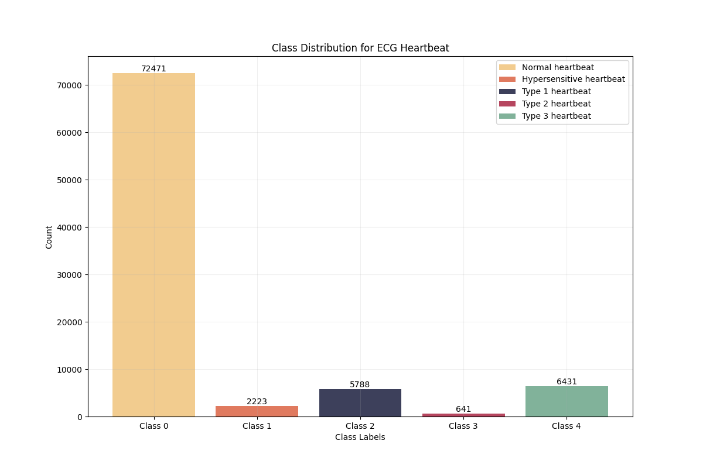
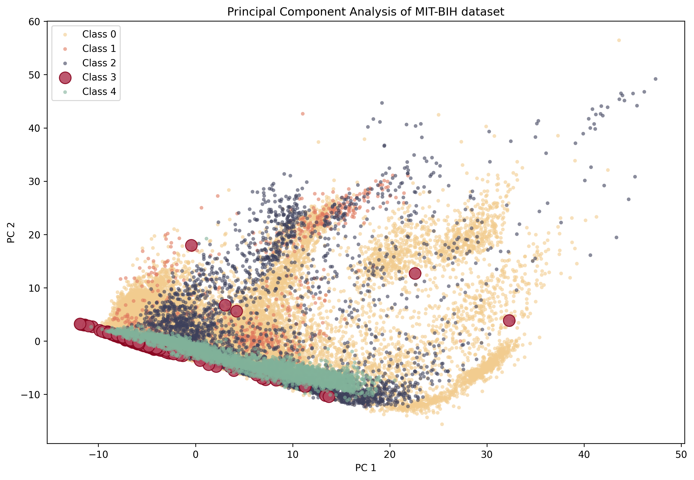

# ECG Arrhythmia Classification Using Deep Learning

## Overview

This project develops a deep learning model for automated ECG arrhythmia classification using the MIT-BIH Arrhythmia Dataset.

The objective is to classify heartbeats into five arrhythmia categories and investigate the challenges of class imbalance in medical datasets. The project includes data preprocessing, imbalance handling, neural network training, model evaluation, and performance analysis.

This work was completed as part of my MSc Data Science studies and combines my background in Biomedical Engineering with Machine Learning.

---

## Dataset

Dataset: MIT-BIH Arrhythmia Database

The dataset contains ECG heartbeat recordings represented by 187 numerical features and one target label.

### Classes

| Class | Description |
|---------|-------------|
| 0 | Normal Beat |
| 1 | Supraventricular Premature Beat |
| 2 | Premature Ventricular Contraction |
| 3 | Fusion Beat |
| 4 | Unclassifiable Beat |

Due to licensing and file size considerations, the dataset is not included in this repository.

---

## Project Pipeline

### 1. Data Preprocessing

- Data cleaning
- Feature standardization using StandardScaler
- Stratified train-validation splitting
- Exploratory analysis of class distributions

### 2. Handling Class Imbalance

Medical datasets are often highly imbalanced.



Techniques explored:

- SMOTE (Synthetic Minority Oversampling Technique)
- Random Under-Sampling
- Class Weights

### 3. Model Development

A Multi-Layer Perceptron (MLP) neural network was developed using TensorFlow/Keras.

#### Best Architecture

```text
Input Layer (187 features)
↓
Dense(256) + ReLU
↓
Dense(128) + ReLU
↓
Dense(64) + ReLU
↓
Dense(32) + ReLU
↓
Output Layer (5 Classes)
```

Additional techniques:

- Dropout Regularization
- Early Stopping
- Adam Optimizer
- Learning Rate = 0.001

---

## Results

### Best Performance

| Metric | Score |
|----------|---------|
| Accuracy | 95% |
| Macro F1 Score | 80% |

### Key Findings

- High overall classification accuracy.
- Strong performance on majority classes.
- Significant improvement in minority-class recall through SMOTE.
- Fusion Beat (Class 3) remained challenging due to severe class imbalance and feature overlap.
- Model achieved high recall for rare arrhythmias but generated additional false positives.

---

## Evaluation Metrics

The model was evaluated using:

- Accuracy
- Precision
- Recall
- F1 Score
- Confusion Matrix
- Classification Report

## Confusion Matrix


---

## Principal Component Analysis (PCA)

### Motivation

While the neural network achieved strong overall performance, a Principal Component Analysis (PCA) was conducted to better understand the underlying structure of the ECG dataset and investigate the reasons behind class-specific classification errors.

### Methodology

The original ECG heartbeat signals contain 187 numerical features. After standardization, PCA was applied to project the data into a two-dimensional feature space defined by the first two principal components (PC1 and PC2).

The first two principal components captured approximately **52% of the total variance**, preserving over half of the information contained within the original dataset while enabling visual interpretation of class relationships.

### PCA Visualization



### Key Findings

The PCA projection revealed several important characteristics of the dataset:

- **Class 0 (Normal Beats)** forms the dominant population and occupies a large region of the feature space.
- **Classes 1, 2, and 4** exhibit partial clustering patterns but still demonstrate considerable overlap with neighboring classes.
- **Class 3 (Fusion Beats)** is heavily dispersed throughout the feature space and overlaps substantially with all other heartbeat categories.

This overlap provides a strong explanation for the model's performance characteristics observed during evaluation.

### Relationship to Model Performance

The classification report showed that **Class 3 achieved a recall of 91% but a precision of only 37%**.

The PCA visualization helps explain this behavior:

- The model successfully identifies most true Class 3 samples, resulting in high recall.
- However, because Class 3 occupies regions shared with other classes, the model frequently predicts Class 3 for samples that belong to other heartbeat categories.
- This leads to an increased number of false positives and consequently lower precision.

Rather than indicating a model weakness, this result reflects the intrinsic difficulty of separating Fusion Beats from other arrhythmia types within the available feature space.

### Clinical Interpretation

The PCA analysis demonstrates that ECG arrhythmia classification is not solely a modelling challenge but also a data representation challenge. Certain heartbeat categories possess highly similar feature patterns, making class separation difficult even after dimensionality reduction.

These findings justify the use of a non-linear neural network architecture and highlight the importance of advanced feature engineering, deep learning, and larger datasets for improving minority-class discrimination in medical AI systems.

### Conclusion

PCA provided valuable insight into the structure of the MIT-BIH dataset and helped explain the model's classification behaviour. Although the first two principal components retained 52% of the total variance, substantial overlap remained between heartbeat classes, particularly for Fusion Beats (Class 3). This explains the observed trade-off between high recall and lower precision and highlights one of the fundamental challenges of automated ECG arrhythmia classification.

---

## Technologies Used

- Python
- NumPy
- Pandas
- Matplotlib
- Seaborn
- Scikit-Learn
- TensorFlow / Keras
- Imbalanced-Learn

---

## Repository Structure

```text
ECG-Arrhythmia-Classification/
│
├── ECG_classification.ipynb
├── README.md
├── requirements.txt
├── figures/
│   ├── confusion_matrix.png
│   ├── loss_curves.png
│   ├── PCA.png
│   ├── System Pipeline.png
│   └── class_distribution.png
│
└── results/
    ├── ANN_model.h5
    └── classification_report.txt
```

---

## Future Improvements

Potential future work includes:

- Convolutional Neural Networks (CNNs)
- Transformer-based architectures
- Cost-sensitive learning
- Explainable AI (SHAP/LIME)
- Deployment as a clinical decision-support system

---

## Author

Ahmed Al Dulaim

MSc Data Science, University of Exeter

BSc Biomedical Engineering

Interested in Machine Learning, Healthcare AI, Computer Vision, and Medical Data Analytics.
